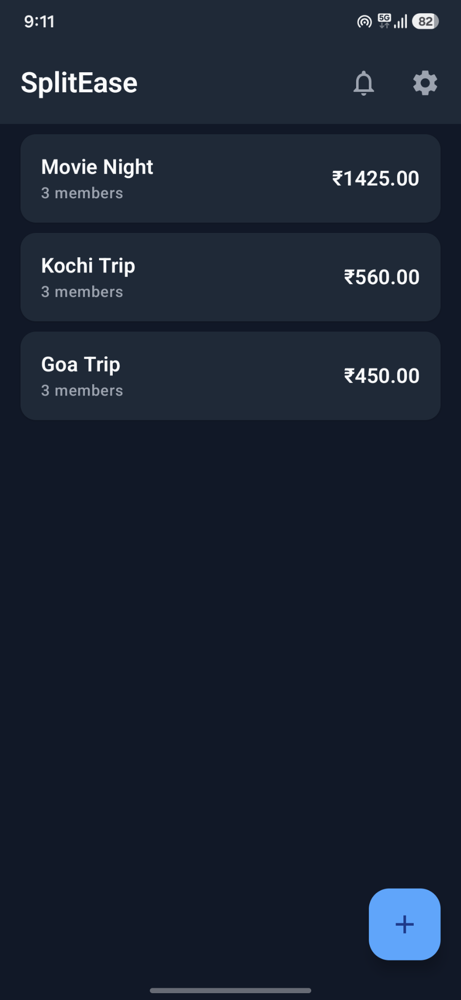
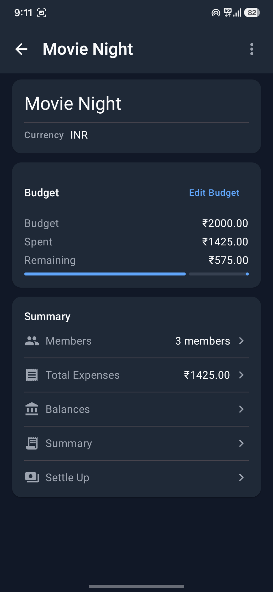
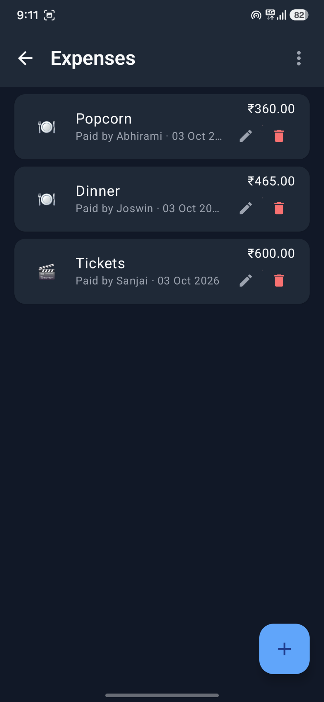
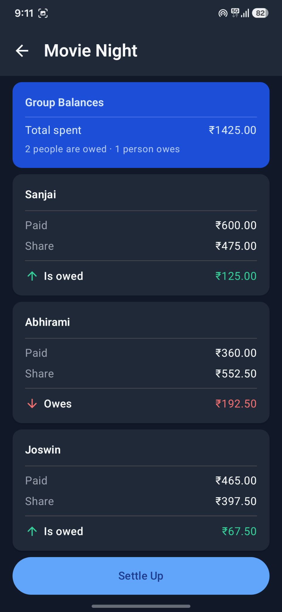
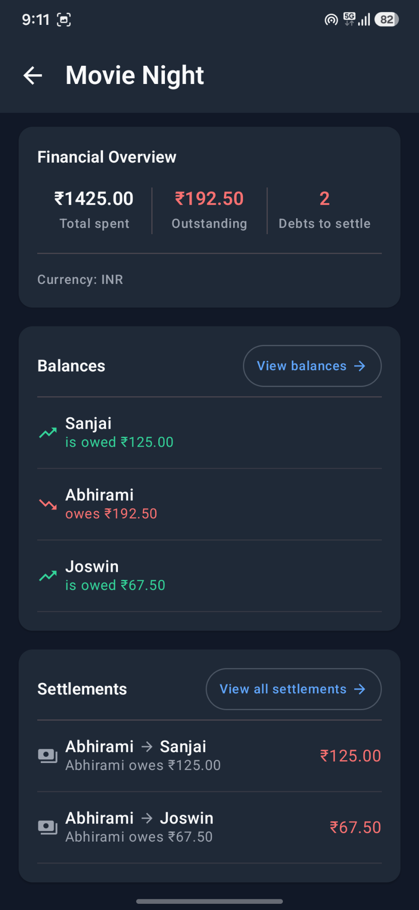
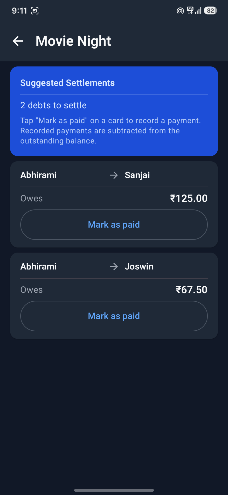
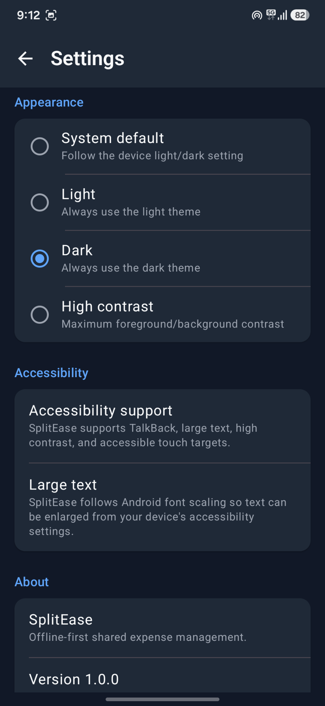

# SplitEase

An offline-first Android app for managing and splitting shared expenses between groups of people.

Built as a university subject project using **Kotlin**, **Jetpack Compose**, **Material 3**, **Room**, and **Coroutines**.

## Screenshots

<table>
  <tr>
    <td align="center"><strong>Groups</strong></td>
    <td align="center"><strong>Group Overview</strong></td>
    <td align="center"><strong>Expenses</strong></td>
  </tr>
  <tr>
    <td></td>
    <td></td>
    <td></td>
  </tr>
  <tr>
    <td align="center"><strong>Balances</strong></td>
    <td align="center"><strong>Summary</strong></td>
    <td align="center"><strong>Settle Up</strong></td>
  </tr>
  <tr>
    <td></td>
    <td></td>
    <td></td>
  </tr>
</table>

### Settings & Accessibility



> The current Settings screenshot shows the in-app version as **1.0.0**. Retake this screenshot after updating the displayed app version to **1.2.0** before publishing the final v1.2.0 README.

## Features

- Create and manage multiple expense groups
- Add and manage group members
- Record and edit expenses
- Four split methods:
  - Equal
  - Exact Amounts
  - Percentage
  - Shares
- Live split preview
- Expense search, filtering, and sorting
- Member balances and simplified settlements
- Settlement payment tracking
- Expense categories and category-based spending summaries
- Group budgets with spending progress
- One-time expense reminders with Android notifications
- CSV expense export
- Light, Dark, System, and High Contrast themes
- Accessibility-focused UI
- First-launch onboarding
- Fully local, offline-first data storage

## What's New in v1.2.0

### Expense Categories

Expenses can be assigned to seven categories:

- Food
- Transport
- Accommodation
- Shopping
- Entertainment
- Bills
- Other

Category spending is shown in the Summary screen and categories are included
in CSV exports.

### Group Budgets

Groups can have an optional spending budget. The Group Overview screen shows
the budget, total spending, remaining or over-budget amount, and progress.

### Expense Reminders

Users can create one-time reminders with a title, date, time, and optional
note. Reminders use Android notifications and are rescheduled after device
reboot.

## Technology Stack

| Technology | Purpose |
|---|---|
| Kotlin | Application language |
| Jetpack Compose | UI |
| Material 3 | Design system |
| Room | Local database |
| Coroutines / Flow | Asynchronous and reactive data |
| ViewModel | UI state and business-flow coordination |
| Navigation Compose | Screen navigation |
| DataStore | Persistent preferences |
| KSP | Code generation |

**Minimum SDK:** 26  
**Target SDK:** 37  
**Java:** 17

## Architecture

SplitEase uses a simple layered architecture:

```text
Presentation
    ↓
Domain / Use Cases
    ↓
Repository
    ↓
Room Database
```

The UI is built with Jetpack Compose. `ViewModel` and `StateFlow` are used for
UI state, while business logic such as expense splitting, balance calculation,
and debt simplification is kept separate from the UI.

## Offline-First

All core application data is stored locally using Room.

- No backend server
- No account required
- No cloud synchronization
- Core functionality works without an internet connection

Monetary values are stored as `Long` minor units rather than `Double` or
`Float` to avoid floating-point rounding problems.

## Expense Splitting

SplitEase supports:

- **Equal** — divides an expense equally among selected members.
- **Exact Amounts** — assigns an exact amount to each member.
- **Percentage** — distributes the expense using percentages.
- **Shares** — distributes the expense according to relative share counts.

Proportional splits use integer minor-unit calculations so the final
allocations always reconcile exactly with the expense total.

## Testing

The project includes JVM unit tests and Android instrumented tests covering
core business logic, ViewModels, data mapping, navigation, Compose UI, CSV
export, reminders, budgets, and Room migrations.

Run unit tests:

```bash
./gradlew test
```

Run instrumented tests:

```bash
./gradlew connectedAndroidTest
```

Instrumented tests require a connected Android device or emulator.

## Download

The latest APK is available from the
[GitHub Releases](https://github.com/sreegovindsubhash/Splitease/releases/latest)
page.

## Building

Clone the repository:

```bash
git clone https://github.com/sreegovindsubhash/Splitease.git
cd Splitease
```

Build the debug APK:

```bash
./gradlew assembleDebug
```

The APK is generated at:

```text
app/build/outputs/apk/debug/app-debug.apk
```

## Limitations

- Data is stored locally on a single device.
- There is no account or cloud synchronization.
- Each group uses a single currency.
- Settlement payments are local records and do not notify other users.
- Reminders are delivered only on the device where they were created.

## AI-Assisted Development

IBM Bob was used as an AI-assisted development tool during the project.
Implementation changes were reviewed, tested, and manually verified during
development.

## Icon Attribution

App icon: Hazicon Glyph by Hazicon, from Flaticon, used under the
Flaticon Free License.
